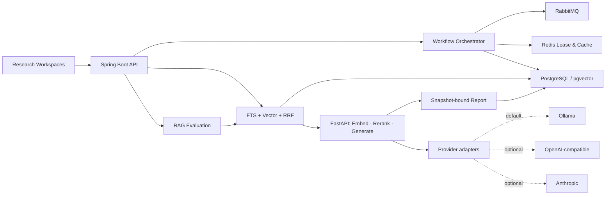

<p align="center">
  
</p>

<h1 align="center">FinSight AI</h1>

<p align="center">
  <strong>Evidence-grounded equity research with recoverable workflows, snapshot-bound reports, and hybrid RAG.</strong>
</p>

<p align="center">
  Turn market data, financial metrics, filings, and company events into structured AI research that can be inspected and reproduced.
</p>

<p align="center">
  <a href="https://github.com/juanjuandog/FinSight-AI/actions/workflows/ci.yml"></a>
  
  
  
  <a href="LICENSE"></a>
</p>

<p align="center">
  <a href="README.zh-CN.md">简体中文</a>
  · <a href="docs/architecture.md">Architecture</a>
  · <a href="docs/api.md">API</a>
  · <a href="#quick-start">Quick Start</a>
</p>


FinSight AI is an open-source A-share research workspace and a backend engineering reference for reliable AI agents. It does more than call a model: long-running research tasks are recoverable, duplicate executions are controlled, reports are bound to data snapshots, and generated conclusions retain an inspectable evidence path.

> FinSight is a research aid, not an automated trading system. Its output is not investment advice.

## A focused research workspace

The interface separates each research activity into a dedicated workspace instead of placing every diagnostic on one dashboard.

| Workspace | Purpose |
| --- | --- |
| Company Research | Search an A-share company and inspect its quote, historical close-price curve, and key financial metrics |
| AI Analysis | Generate a structured conclusion with confidence, supporting factors, and risk factors |
| Evidence | Search filings, announcements, and structured metrics for verifiable source material |
| Recent Events | Review disclosures, metric changes, and risk signals on a company timeline |
| Watchlist | Keep a concise list of companies for continued research |

## Why FinSight is different

| Engineering problem | FinSight approach | Implementation |
| --- | --- | --- |
| Long-running AI tasks fail halfway | Recoverable stages, explicit task states, retries, timeout takeover, and dead-letter handling | [`WorkflowOrchestrator`](backend/src/main/java/com/finsight/workflow/WorkflowOrchestrator.java) |
| Identical requests amplify expensive work | Idempotency keys plus a Redis Lua single-flight lease and fencing token | [`RedisBackedWorkflowLeaseService`](backend/src/main/java/com/finsight/workflow/RedisBackedWorkflowLeaseService.java) |
| A cached report becomes stale when data changes | `dataSnapshotHash`, `contextHash`, and `reportVersion` bind a report to its source state | [`StockAiAnalysisService`](backend/src/main/java/com/finsight/application/StockAiAnalysisService.java) |
| RAG answers are difficult to verify | Full-text and vector recall, reciprocal-rank fusion, reranking, evidence trace, and regression evaluation | [`HybridRetrievalGateway`](backend/src/main/java/com/finsight/rag/HybridRetrievalGateway.java) |
| Model infrastructure changes independently | Embedding, reranking, and generation run behind a FastAPI sidecar with deterministic fallbacks | [`ai-service`](ai-service/app/main.py) |

## From question to evidence

1. A research request creates an idempotent task.
2. RabbitMQ dispatches data ingestion, metric calculation, indexing, intelligence building, and report generation.
3. Redis coordinates duplicate work while PostgreSQL/pgvector stores snapshots, vectors, evidence, and reports.
4. Hybrid retrieval supplies reranked evidence to the AI sidecar.
5. The final report preserves its version, snapshot hash, model source, and evidence trace.


## Quick Start

### Lightweight preview

Use this path to inspect the product and core flow with Java 17 and Maven. It runs with local in-memory adapters and does not require infrastructure services.

```bash
git clone https://github.com/juanjuandog/FinSight-AI.git
cd FinSight-AI/backend
mvn spring-boot:run
```

Open [http://localhost:8080](http://localhost:8080).

### Full research stack

Use Docker Compose to run PostgreSQL/pgvector, Redis, RabbitMQ, the Spring Boot backend, and the FastAPI AI sidecar together.

```bash
git clone https://github.com/juanjuandog/FinSight-AI.git
cd FinSight-AI
docker compose up -d --build
./scripts/quick-demo.sh
```

The default demo requires no API key. Ollama is the default local provider, while the sidecar also has adapters for OpenAI-compatible APIs and Anthropic. If a selected model is unavailable or unconfigured, deterministic fallbacks keep the flow runnable. Allow roughly 8 GB of free memory for the complete Compose stack.

| Mode | Best for | Runtime |
| --- | --- | --- |
| Lightweight | UI review, code reading, and interview demos | Java 17, Maven |
| Full stack | Workflow recovery, Redis coordination, pgvector retrieval, and AI sidecar integration | Docker Compose |

For profiles, environment variables, service URLs, and recovery steps, see [Troubleshooting](docs/troubleshooting.md).

## Architecture



The Spring Boot service owns domain state and orchestration. The Python sidecar owns model-facing operations. This boundary keeps workflow recovery and report consistency independent from the chosen model runtime.

Read the [architecture notes](docs/architecture.md) for the complete request, state, and data flows.

## Technology

| Layer | Stack |
| --- | --- |
| Core API | Java 17, Spring Boot 3.3.5, JDBC, Flyway |
| Workflow | RabbitMQ, task state machine, retry and dead-letter recovery |
| Coordination | Redis, Lua leases, fencing tokens, snapshot-aware cache |
| Retrieval | PostgreSQL JSONB, full-text search, pgvector, RRF, reranking |
| AI runtime | FastAPI, sentence embeddings, cross-encoder reranking, Ollama/OpenAI-compatible/Anthropic adapters |
| Product UI | Responsive HTML, CSS, and JavaScript served by Spring Boot |
| Operations | Docker Compose, Actuator, Prometheus, GitHub Actions |

## Repository map

```text
backend/        Spring Boot API, workflow, retrieval, metrics, and static UI
ai-service/     FastAPI embedding, reranking, and generation sidecar
scripts/        Demo, verification, benchmark, and screenshot workflows
docs/           Architecture, API, benchmark, product, and interview notes
docker-compose.yml
```

## Validation

CI protects the main branch with:

- Maven unit and integration tests, including Testcontainers-backed infrastructure tests;
- shell-script syntax checks;
- Python service and benchmark-script syntax checks.

Run the backend suite locally:

```bash
cd backend
mvn test
```

## Documentation

- [Architecture](docs/architecture.md)
- [Research API](docs/api.md)
- [Agent Workflow Design](docs/design-agent-workflow.md)
- [Benchmark and Evaluation](docs/benchmark.md)
- [Product Requirements](docs/product-requirements.md)
- [Accounts and Personal Workspace PRD](docs/prd-user-accounts-and-workspaces.md)
- [Development and Integration Tests](docs/development.md)
- [Troubleshooting](docs/troubleshooting.md)
- [Roadmap](ROADMAP.md)
- [Contributing](CONTRIBUTING.md)

## Scope

FinSight currently targets A-share research and local, production-like demonstrations, with email accounts, server-side sessions, and private watchlists. Team workspaces, regulated research workflows, trade execution, portfolio advice, and multi-market coverage remain outside the current scope.

## Contributors

Thanks to everyone who has contributed to FinSight AI.

<a href="https://github.com/juanjuandog/FinSight-AI/graphs/contributors">
  
</a>

## License

Released under the [MIT License](LICENSE).
