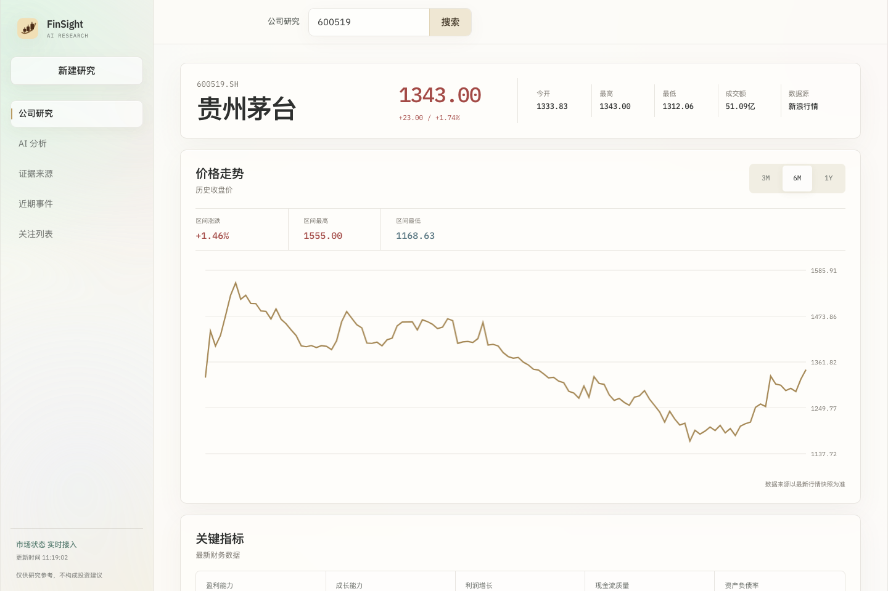
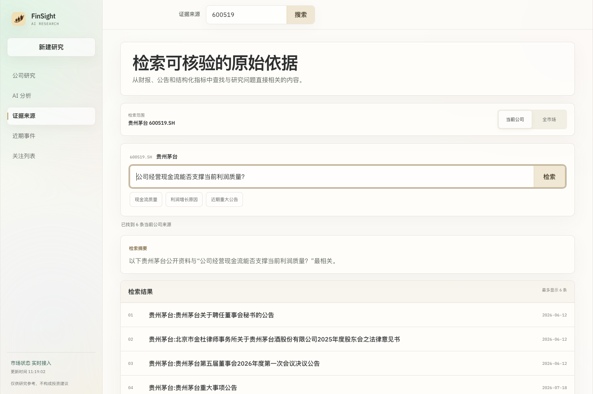
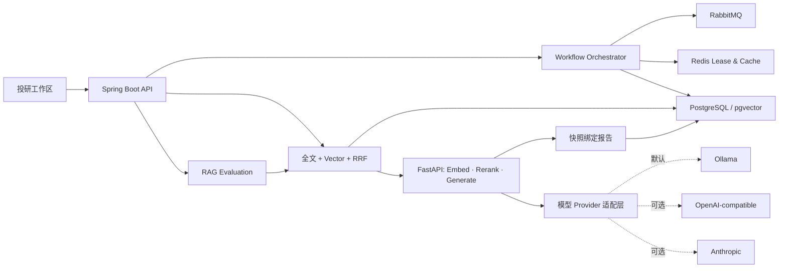

<p align="center">
  
</p>

<h1 align="center">FinSight AI</h1>

<p align="center">
  <strong>证据驱动的股票投研系统：可恢复工作流、快照绑定报告与混合 RAG。</strong>
</p>

<p align="center">
  将行情、财务指标、公告与公司事件整理成结构化、可核验、可复现的 AI 投研结论。
</p>

<p align="center">
  <a href="https://github.com/juanjuandog/FinSight-AI/actions/workflows/ci.yml"></a>
  
  
  
  <a href="LICENSE"></a>
</p>

<p align="center">
  <a href="README.md">English</a>
  · <a href="docs/architecture.md">系统架构</a>
  · <a href="docs/api.md">API</a>
  · <a href="#快速开始">快速开始</a>
</p>



FinSight AI 是一个面向 A 股的开源投研工作台，也是可靠 AI Agent 的后端工程实践。它不止调用一次模型：长链路研究任务可以恢复，重复执行受到控制，报告与数据快照绑定，生成结论保留可检查的证据路径。

> FinSight 是研究辅助工具，不是自动交易系统，其输出不构成投资建议。

## 专注的投研工作区

界面将不同研究活动拆分为独立工作区，不再把内部诊断信息和用户功能堆在同一个 Dashboard。

| 工作区 | 用途 |
| --- | --- |
| 公司研究 | 搜索 A 股公司，查看行情、历史收盘价折线图和关键财务指标 |
| AI 分析 | 生成包含置信度、支持因素和风险因素的结构化结论 |
| 证据来源 | 从财报、公告和结构化指标中检索可核验的原始依据 |
| 近期事件 | 沿时间线查看公开披露、指标变化和风险信号 |
| 关注列表 | 保存需要持续研究的公司，并快速返回公司工作区 |

## FinSight 有什么不同

| 工程问题 | FinSight 的处理方式 | 关键实现 |
| --- | --- | --- |
| AI 长任务可能在中途失败 | 可恢复阶段、显式任务状态、重试、超时接管与死信处理 | [`WorkflowOrchestrator`](backend/src/main/java/com/finsight/workflow/WorkflowOrchestrator.java) |
| 相同请求放大昂贵计算 | 幂等键、Redis Lua Single-flight Lease 与 Fencing Token | [`RedisBackedWorkflowLeaseService`](backend/src/main/java/com/finsight/workflow/RedisBackedWorkflowLeaseService.java) |
| 数据变化后缓存报告已经过期 | 使用 `dataSnapshotHash`、`contextHash` 和 `reportVersion` 绑定来源状态 | [`StockAiAnalysisService`](backend/src/main/java/com/finsight/application/StockAiAnalysisService.java) |
| RAG 结论难以验证 | 全文与向量召回、RRF、Rerank、Evidence Trace 和回归评测 | [`HybridRetrievalGateway`](backend/src/main/java/com/finsight/rag/HybridRetrievalGateway.java) |
| 模型基础设施需要独立演进 | Embedding、Rerank 和生成封装为 FastAPI Sidecar，并保留确定性降级 | [`ai-service`](ai-service/app/main.py) |

## 从问题到证据

1. 研究请求首先创建一个幂等任务。
2. RabbitMQ 调度数据采集、指标计算、文档索引、公司画像和报告生成。
3. Redis 协调重复任务，PostgreSQL/pgvector 保存数据快照、向量、证据与报告。
4. 混合检索选出并重排证据，再交给 AI Sidecar。
5. 最终报告保留版本、快照哈希、模型来源和证据轨迹。



## 快速开始

### 轻量预览

适合快速查看产品和核心流程。只需要 Java 17 与 Maven，默认使用本地内存适配器，不依赖外部基础设施。

```bash
git clone https://github.com/juanjuandog/FinSight-AI.git
cd FinSight-AI/backend
mvn spring-boot:run
```

打开 [http://localhost:8080](http://localhost:8080)。

### 完整投研栈

通过 Docker Compose 同时运行 PostgreSQL/pgvector、Redis、RabbitMQ、Spring Boot Backend 和 FastAPI AI Sidecar。

```bash
git clone https://github.com/juanjuandog/FinSight-AI.git
cd FinSight-AI
docker compose up -d --build
./scripts/quick-demo.sh
```

默认 Demo 不需要 API Key。Ollama 是默认本地 provider，Sidecar 同时预留了 OpenAI-compatible API 和 Anthropic 适配器。选中的模型不可用或未配置凭证时，会使用确定性降级保持主流程可运行。完整 Compose 栈建议预留约 8 GB 可用内存。

| 模式 | 适合场景 | 运行环境 |
| --- | --- | --- |
| 轻量模式 | 查看 UI、阅读代码和面试演示 | Java 17、Maven |
| 完整模式 | 演示任务恢复、Redis 协调、pgvector 检索和 AI Sidecar | Docker Compose |

Profile、环境变量、服务地址和故障恢复步骤见[故障排查文档](docs/troubleshooting.md)。

## 系统架构



Spring Boot 服务负责领域状态和任务编排，Python Sidecar 负责面向模型的操作。这个边界让工作流恢复和报告一致性不依赖具体模型运行时。

完整的请求流、状态流和数据流见[架构文档](docs/architecture.md)。

## 技术栈

| 层级 | 技术 |
| --- | --- |
| 核心 API | Java 17、Spring Boot 3.3.5、JDBC、Flyway |
| 任务工作流 | RabbitMQ、任务状态机、重试和死信恢复 |
| 分布式协调 | Redis、Lua Lease、Fencing Token、快照感知缓存 |
| 检索 | PostgreSQL JSONB、全文检索、pgvector、RRF、Rerank |
| AI 运行时 | FastAPI、Sentence Embedding、Cross-encoder Rerank、Ollama/OpenAI-compatible/Anthropic 适配器 |
| 产品前端 | 由 Spring Boot 托管的响应式 HTML、CSS 和 JavaScript |
| 工程运维 | Docker Compose、Actuator、Prometheus、GitHub Actions |

## 仓库结构

```text
backend/        Spring Boot API、工作流、检索、指标与静态前端
ai-service/     FastAPI Embedding、Rerank 与生成 Sidecar
scripts/        Demo、验证、Benchmark 与截图脚本
docs/           架构、API、评测、产品和面试说明
docker-compose.yml
```

## 质量验证

主分支 CI 包含：

- Maven 单元测试与集成测试，包括基于 Testcontainers 的基础设施测试；
- Shell 脚本语法检查；
- Python 服务与 Benchmark 脚本语法检查。

本地运行 Backend 测试：

```bash
cd backend
mvn test
```

## 文档

- [系统架构](docs/architecture.md)
- [Research API](docs/api.md)
- [Agent 工作流设计](docs/design-agent-workflow.md)
- [Benchmark 与评测](docs/benchmark.md)
- [产品需求](docs/product-requirements.md)
- [故障排查](docs/troubleshooting.md)
- [Roadmap](ROADMAP.md)
- [参与贡献](CONTRIBUTING.md)

## 当前边界

FinSight 当前面向 A 股研究和本地 Production-like 演示。用户鉴权、受监管投研流程、交易执行、组合建议和多市场支持不在当前范围内。

## License

项目基于 [MIT License](LICENSE) 发布。
