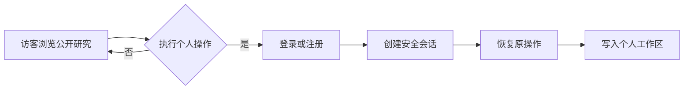

# PRD：用户账户与个人研究工作区

**产品：** FinSight AI  
**版本：** MVP v1.0  
**状态：** 待开发  
**负责人：** FinSight AI 产品与工程  
**关联文档：** [产品需求](product-requirements.md)、[架构](architecture.md)、[API](api.md)

## 1. 背景与问题

FinSight 已能完成公司研究、报告生成、证据检索和关注列表，但当前使用一个可选的
`X-Finsight-User` 请求头区分关注列表归属。它不是账号体系：用户没有登录入口，
数据归属不可靠，也无法在不同设备上连续使用。

本期要将 FinSight 从“共享演示工作台”升级为“个人研究工具”。用户登录后应能看到
只属于自己的关注公司、研究记录、收藏报告和笔记；退出后，其他用户不能读取或修改
这些内容。公开市场数据与系统生成的基础报告仍可复用，不为每个用户重复计算。

## 2. 目标与非目标

### 目标

1. 提供安全、低门槛的邮箱注册、登录与退出。
2. 将个人数据稳定绑定到账号，而非客户端可伪造的请求头。
3. 让用户在任意设备登录后恢复自己的研究工作区。
4. 保存“我为什么关注它”的个人语境：关注列表、报告收藏和研究笔记。
5. 不改变现有公司研究、证据检索和 AI 报告生成主流程。

### 非目标（MVP 不做）

- 团队空间、多人协作、评论、分享链接和权限管理。
- 订阅、付费、额度计费或企业 SSO。
- 交易、持仓同步、自动下单或收益承诺。
- 社交资料、头像上传、手机号登录、复杂的账号设置。
- 对每位用户重复生成一套相同的市场数据或基础 AI 报告。

## 3. 目标用户与核心场景

| 用户 | 需求 | 完成标准 |
| --- | --- | --- |
| 个人研究者 | 登录后继续昨天的研究 | 在另一台设备登录，关注列表、收藏和笔记一致出现 |
| 高频跟踪者 | 给关注公司写下研究理由 | 在公司页快速新增、编辑和删除私有笔记 |
| 回顾型用户 | 找回之前看过的报告 | 在“研究历史”按公司、时间查看已保存的报告快照 |
| 新用户 | 不希望注册阻挡首次体验 | 可浏览公开公司数据；尝试保存时再引导登录 |

## 4. 产品原则

- **公开研究，私有组织。** 行情、公开文件、系统报告可读取；用户的关注、收藏、笔记和最近研究记录默认私有。
- **先阅读，后登录。** 访客可搜索和查看公开研究；所有写入个人空间的动作要求登录。
- **少一步账户摩擦。** MVP 只使用邮箱与密码；注册后直接登录，不增加邮箱验证阻塞主流程。
- **可撤销且不丢数据。** 关注、收藏和笔记均提供删除；删除账号必须二次确认并有 30 天恢复窗口。
- **证据与个人观点分离。** 系统报告不可被用户改写；用户笔记单独展示，避免与可核验证据混淆。

## 5. 信息架构与交互

### 5.1 访客状态

左侧导航底部显示“登录以保存研究”。访客可以使用公司研究、AI 分析、证据来源和近期事件；点击以下动作时打开登录弹窗：

- 加入关注列表；
- 收藏报告；
- 新建或编辑研究笔记；
- 查看个人工作区。

登录完成后，系统返回原动作并继续执行，不要求用户重新点击。

### 5.2 已登录状态

左侧导航保留现有五个主工作区，并在底部加入轻量账户菜单：显示邮箱前缀和“退出登录”。不增加右侧栏。

个人工作区包含三个独立入口：

| 入口 | 内容 | 主要操作 |
| --- | --- | --- |
| 关注列表 | 用户关注的公司及最近查看时间 | 打开研究、移除关注 |
| 研究历史 | 用户主动生成或收藏的报告版本 | 查看报告、收藏/取消收藏 |
| 我的笔记 | 按公司聚合的私有笔记 | 新建、编辑、删除、跳转公司 |

公司研究页不堆叠整块个人内容。仅在公司名附近提供两个轻量动作：“关注/已关注”和“笔记”；笔记在独立工作区打开。

### 5.3 账户流程

## 6. 功能需求

### F1. 注册、登录与会话

**注册**

- 输入邮箱、密码和确认密码。
- 邮箱必须规范化为小写；同一邮箱不可重复注册。
- 密码最少 10 位，且至少包含字母和数字；页面展示即时规则提示，但仅在提交后显示错误。
- 注册成功后自动创建会话并进入当前页面。

**登录与退出**

- 邮箱密码登录；错误提示统一为“邮箱或密码不正确”，不泄露账号是否存在。
- 登录会话使用 `HttpOnly`、`Secure`、`SameSite=Lax` Cookie；前端不保存 access token。
- 会话有效期 14 天；用户主动退出后立即失效。
- 同一账号可在多个设备登录；MVP 不提供设备管理。

**验收标准**

- 未登录调用任意个人写接口返回 `401`，前端打开登录弹窗。
- 伪造或修改 `X-Finsight-User` 不会改变任何数据归属。
- Cookie 不可由前端 JavaScript 读取。

### F2. 个人关注列表

- 以已登录用户 ID 为唯一归属，替换当前请求头归属。
- 同一用户同一股票只能关注一次；不同用户可分别关注同一股票。
- 关注列表显示公司名称、代码、关注时间和最近研究时间。
- 移除关注只影响当前用户，不删除系统公司、报告或其他用户数据。
- 现有匿名/演示 `user_watchlists` 数据在迁移后不自动分配给新用户，保留为不可见历史数据。

**验收标准**

- 用户 A 的关注列表不包含用户 B 新增的公司。
- 刷新、重新登录和跨设备登录后，用户 A 的关注列表一致。
- 重复点击“加入当前公司”不会新增重复记录。

### F3. 研究历史与报告收藏

- 用户点击“生成分析”后，记录一条私有研究活动，关联公司、报告版本、触发时间和报告快照 ID。
- 用户可收藏任意可见报告版本；收藏不复制报告正文。
- 历史按最近操作时间倒序展示，默认 30 条，支持分页。
- 报告更新后，历史记录始终指向当时的版本；用户可同时看到“当前最新版”和“当时保存版本”。
- 删除个人历史仅删除活动/收藏关联，不影响底层系统报告。

**验收标准**

- 同一份报告被不同用户收藏不会产生重复报告实体。
- 用户删除收藏后，仍可从公开公司页查看该报告，但不再出现在个人工作区。
- 当报告版本不存在或已归档时，历史显示“报告已不可用”，不报错。

### F4. 私有研究笔记

- 每条笔记归属一个用户和一家公司；可选关联一个报告版本。
- 字段：标题（最多 80 字）、正文（最多 5,000 字）、标签（最多 5 个）、创建/更新时间。
- 支持创建、编辑、删除；删除后进入 30 天软删除状态，MVP 不提供界面恢复入口。
- 不支持 Markdown 图片、外链抓取、协作编辑或公开分享。
- 笔记明确标记为“个人笔记”，不与系统证据、AI 结论混排。

**验收标准**

- 用户 A 无法通过 URL、API 或前端列表读取用户 B 的笔记。
- 编辑笔记后更新时间变化，历史版本不要求保存。
- 删除笔记后默认列表和公司页均不可见。

### F5. 账户与数据控制

- 账户菜单提供“退出登录”和“删除账户”。
- 删除账户必须输入邮箱确认，并展示影响范围：关注、收藏、历史与笔记将被删除；系统公开数据不受影响。
- 提交后账号标记删除，30 天后物理清理；恢复窗口内可通过同邮箱登录恢复。
- 个人数据导出和忘记密码在 MVP 记录为后续项，不阻塞上线。

## 7. 数据模型与数据边界

### 新增实体

| 表 | 核心字段 | 说明 |
| --- | --- | --- |
| `users` | `id`, `email`, `password_hash`, `status`, `created_at`, `deleted_at` | 账号主体，密码采用 Argon2id 或 BCrypt 哈希 |
| `user_sessions` | `id`, `user_id`, `token_hash`, `expires_at`, `revoked_at` | 仅存会话 token 哈希，Cookie 中保存原始随机 token |
| `user_report_activity` | `id`, `user_id`, `company_symbol`, `report_id`, `activity_type`, `created_at` | `GENERATED`、`SAVED`、`VIEWED` 等个人活动 |
| `user_research_notes` | `id`, `user_id`, `company_symbol`, `report_id`, `title`, `body`, `tags`, `created_at`, `updated_at`, `deleted_at` | 私有笔记 |

### 现有实体调整

- `user_watchlists.user_id` 改为引用 `users.id`，不再从 `X-Finsight-User` 获得。
- `stock_analysis_reports` 保持系统级共享实体，不添加 `user_id`。
- 所有个人表必须带 `user_id` 索引；查询必须在服务层和 SQL 层同时按当前登录用户过滤。

### 数据隔离规则

| 数据 | 归属 | 可见性 |
| --- | --- | --- |
| 行情、财务指标、公告、证据 | 系统 | 公开只读 |
| 系统 AI 报告与版本 | 系统 | 公开只读 |
| 关注列表、收藏、历史、笔记 | 用户 | 仅本人可读写 |
| 账号与会话 | 用户 | 仅本人可操作；服务端可审计 |

## 8. API 契约（MVP）

| 方法 | 路径 | 认证 | 说明 |
| --- | --- | --- | --- |
| `POST` | `/api/auth/register` | 否 | 注册并创建会话 |
| `POST` | `/api/auth/login` | 否 | 登录并创建会话 |
| `POST` | `/api/auth/logout` | 是 | 撤销当前会话 |
| `GET` | `/api/auth/me` | 是 | 返回当前用户基础信息 |
| `GET/POST/DELETE` | `/api/watchlist` | 是 | 保持现有语义，改用会话用户 |
| `GET` | `/api/workspace/reports` | 是 | 研究历史与收藏列表 |
| `POST/DELETE` | `/api/workspace/reports/{reportId}/saved` | 是 | 收藏/取消收藏 |
| `GET/POST` | `/api/workspace/notes` | 是 | 列表、新建笔记 |
| `PATCH/DELETE` | `/api/workspace/notes/{noteId}` | 是 | 修改、软删除本人笔记 |
| `DELETE` | `/api/account` | 是 | 发起账户删除 |

API 出错约定：未登录 `401`、访问其他用户资源或不存在资源均返回 `404`、格式校验失败 `400`、冲突（重复邮箱/重复收藏）`409`。响应不得包含密码哈希、会话 token 或其他用户 ID。

## 9. 非功能与安全要求

- 密码哈希使用可配置成本的 Argon2id（优先）或 BCrypt；绝不存储明文密码。
- 登录、注册、密码错误和笔记写入均做 IP + 账号维度限流。
- 所有写请求使用 CSRF 防护；Cookie 仅在 HTTPS 生产环境设置 `Secure`。
- 服务端日志只记录匿名化用户标识，禁止记录密码、Cookie、完整笔记正文。
- 会话、笔记与账户相关 API 必须有审计事件：登录成功/失败、退出、账号删除、笔记删除。
- 个人读接口 p95 < 500 ms；写接口 p95 < 800 ms（不含 AI 报告生成）。
- 数据库迁移必须向前兼容：先新增用户与会话表，再迁移 `user_watchlists` 约束，最后移除请求头兼容逻辑。

## 10. 埋点与成功指标

上线后 30 天观察以下指标，不预设数值承诺：

- 注册完成率、首次登录成功率、7 日回访率；
- 登录用户中至少创建一次关注、收藏或笔记的比例；
- 每位活跃用户的关注公司数、收藏报告数、笔记数；
- 未登录写操作触发登录后原动作恢复成功率；
- 登录失败、会话失效、跨用户授权拒绝、账号删除失败率。

## 11. 分期与发布门槛

### Phase 1：账号与关注列表

账户、会话、`/me`、登录弹窗、服务端用户上下文、关注列表迁移。

### Phase 2：研究历史与收藏

生成活动记录、报告收藏、历史工作区、报告版本跳转。

### Phase 3：个人笔记与账户删除

笔记 CRUD、软删除、删除账户与审计事件。

### 发布门槛

- 访客可阅读公开研究，但不能写入个人数据。
- 认证、授权、会话撤销、CSRF、限流与跨用户隔离均有自动化测试。
- PostgreSQL Flyway 迁移可从当前生产 schema 升级，也可在空库初始化。
- 前端在 375px 和桌面宽度下可完成注册、登录、退出、关注和笔记创建。
- 不在前端代码、日志、错误响应或数据库中暴露明文密码和 session token。

## 12. 已确认决策

| 决策 | 结论 |
| --- | --- |
| 未验证邮箱使用期限 | 账号可长期使用，不限制为 24 小时；单次登录会话有效期为 14 天 |
| 登录页面语言 | 中文优先 |
| 报告生成历史 | 仅记录用户主动点击“生成分析”，自动刷新不写入个人历史 |
| 账户恢复窗口 | 采用 30 天恢复窗口 |
| 密码重置 | Phase 1 提供邮件重置能力；未配置 SMTP 时仍返回统一安全提示 |
