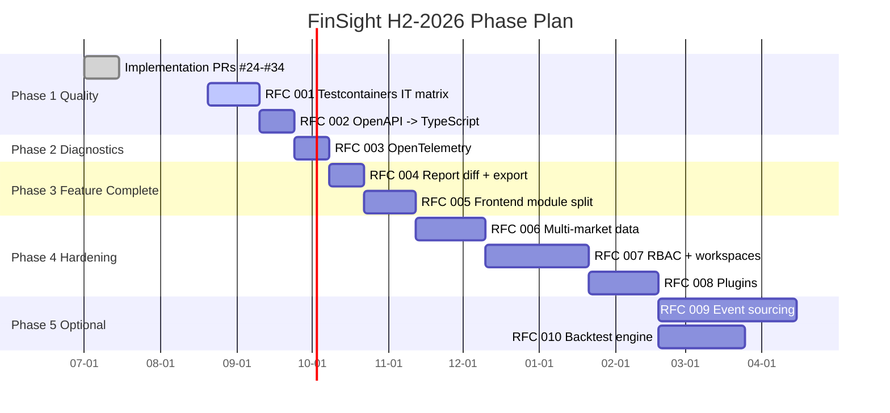

# FinSight-AI 2026 H2 Roadmap

This document ties together the **11 implementation PRs already on
the wire** (#24-#34) and the **10 RFCs and matching issues**
(#35-#56) into a multi-quarter delivery plan.

The structure below is the recommended sequencing. Each phase
ships behind a single `mvn verify` green light so the project
remains releasable at every step. LoC estimates are from the
matching RFC and exclude generated / vendored artefacts.

## Phases

## Phase 1 — Quality

> **Goal:** every code path exercised by a real test; every
> backend endpoint reachable from a typed client.

| RFC | Title | Issue | PR | LoC |
| --- | --- | --- | --- | --- |
| (impl) | Implementation PRs already on the wire | — | [#24](https://github.com/juanjuandog/FinSight-AI/pull/24) … [#34](https://github.com/juanjuandog/FinSight-AI/pull/34) | n/a |
| 001 | Testcontainers Integration Test Suite | [#47](https://github.com/juanjuandog/FinSight-AI/issues/47) | [#35](https://github.com/juanjuandog/FinSight-AI/pull/35) / [#40](https://github.com/juanjuandog/FinSight-AI/pull/40) | ~2,800 |
| 002 | OpenAPI → TypeScript Typed API Client | [#48](https://github.com/juanjuandog/FinSight-AI/issues/48) | [#36](https://github.com/juanjuandog/FinSight-AI/pull/36) / [#40](https://github.com/juanjuandog/FinSight-AI/pull/40) | ~1,800 |

**Exit criteria:**

- `mvn verify` is green on the latest `master` with Testcontainers
  able to start Docker in CI; the 50 IT matrix covers Postgres +
  pgvector + Redis + RabbitMQ + AI sidecar paths.
- `npm run build` produces a typed client; `app.js`'s 50+ `fetch`
  call sites are routed through typed wrappers; CSP drops
  `unsafe-inline` for `script-src`.

## Phase 2 — Diagnostics

| RFC | Title | Issue | PR | LoC |
| --- | --- | --- | --- | --- |
| 003 | OpenTelemetry Distributed Tracing | [#49](https://github.com/juanjuandog/FinSight-AI/issues/49) | [#37](https://github.com/juanjuandog/FinSight-AI/pull/37) / [#40](https://github.com/juanjuandog/FinSight-AI/pull/40) | ~2,200 |

**Exit criteria:**

- A full `/api/research/stock/{symbol}/analyze` request produces
  6+ spans covering workflow stages, RAG retrieval, AI sidecar.
- Trace context propagates to the Python sidecar and back; a
  `traceparent` header on a 4xx/5xx response identifies the
  failed trace in Jaeger.
- A regression IT pins the expected span topology.

## Phase 3 — Feature Complete

| RFC | Title | Issue | PR | LoC |
| --- | --- | --- | --- | --- |
| 004 | Report Diff View + Markdown / PDF Export | [#50](https://github.com/juanjuandog/FinSight-AI/issues/50) | [#38](https://github.com/juanjuandog/FinSight-AI/pull/38) / [#40](https://github.com/juanjuandog/FinSight-AI/pull/40) | ~1,800 |
| 005 | Frontend SPA Modularization | [#51](https://github.com/juanjuandog/FinSight-AI/issues/51) | [#39](https://github.com/juanjuandog/FinSight-AI/pull/39) / [#40](https://github.com/juanjuandog/FinSight-AI/pull/40) | ~3,200 |

**Exit criteria:**

- `GET /api/research/stock/{symbol}/reports/{a}/diff/{b}` returns
  structured diffs; the static UI renders them side by side.
- `.md` and `.pdf` exports ship with a Noto CJK font; PDFs
  render in stock readers; the file is ≤ 1.5 MB.
- The 1779-line `app.js` IIFE is gone; `frontend/src/` hosts
  ~25 typed modules; `vitest` covers ≥ 50% lines.

## Phase 4 — Hardening

| RFC | Title | Issue | PR | LoC |
| --- | --- | --- | --- | --- |
| 006 | Multi-Market Data Abstraction Layer | [#52](https://github.com/juanjuandog/FinSight-AI/issues/52) | [#41](https://github.com/juanjuandog/FinSight-AI/pull/41) / [#46](https://github.com/juanjuandog/FinSight-AI/pull/46) | ~2,400 |
| 007 | RBAC + Workspaces + Team Membership | [#53](https://github.com/juanjuandog/FinSight-AI/issues/53) | [#42](https://github.com/juanjuandog/FinSight-AI/pull/42) / [#46](https://github.com/juanjuandog/FinSight-AI/pull/46) | ~3,250 |
| 008 | LLM Provider & Data Source Plugin System | [#54](https://github.com/juanjuandog/FinSight-AI/issues/54) | [#43](https://github.com/juanjuandog/FinSight-AI/pull/43) / [#46](https://github.com/juanjuandog/FinSight-AI/pull/46) | ~2,650 |

**Exit criteria:**

- `MarketAdapter` interface covers ASHARE / HKEX / US; a search
  for `00700.HK` returns a `HKD` quote; a search for `AAPL`
  returns a `USD` quote.
- A `VIEWER` member attempting `POST /api/watchlist` receives
  `403 WorkspaceAccessDeniedException`; ACL decorators run on
  every `*Repository` whose model implements `AclChecked`.
- Ollama / OpenAI / Anthropic adapters live as Python entry
  points; a sample third-party plugin installs via
  `install-plugin.sh`; an unsigned plugin is rejected.

## Phase 5 — Optional / Future

| RFC | Title | Issue | PR | LoC |
| --- | --- | --- | --- | --- |
| 009 | Event Sourcing for Workflow State | [#55](https://github.com/juanjuandog/FinSight-AI/issues/55) | [#44](https://github.com/juanjuandog/FinSight-AI/pull/44) / [#46](https://github.com/juanjuandog/FinSight-AI/pull/46) | ~2,900 |
| 010 | Investment Signal Backtest Engine | [#56](https://github.com/juanjuandog/FinSight-AI/issues/56) | [#45](https://github.com/juanjuandog/FinSight-AI/pull/45) / [#46](https://github.com/juanjuandog/FinSight-AI/pull/46) | ~4,000 |

**Exit criteria:**

- A workflow task exercising the entire happy path produces
  ~10 rows in `workflow_events` plus the latest
  `workflow_tasks` projection; the projection recovers
  identically across a process restart.
- A backtest of the AI rating signal on 2024 A-share data
  completes in < 30 s; the metrics block reports Sharpe /
  Sortino / MaxDD / IC / RankIC / hitRate.

## Cross-cutting artefacts

- `docs/rfcs/RFC-001-…-010-*.md` — design documents.
- `docs/issues/issue-001-…-010-*.md` — task checklists, mirrored
  to the GitHub issues above.
- `docs/api.md` — kept current as new endpoints land; the
  springdoc-generated `/v3/api-docs` (commit `72b20b1`) is the
  machine-readable counterpart.
- `docs/architecture.md` — updated as the plugin layer (RFC 008)
  and event-sourcing (RFC 009) reshape the runtime topology.

## Total LoC summary

| Phase | LoC |
| --- | --- |
| Phase 1 (Quality) | ~4,600 |
| Phase 2 (Diagnostics) | ~2,200 |
| Phase 3 (Feature Complete) | ~5,000 |
| Phase 4 (Hardening) | ~8,300 |
| Phase 5 (Optional / Future) | ~6,900 |
| **Backlog total** | **~27,000** |

Compared to the current project size of ~14,000 LoC, this is
roughly **1.9×** the existing body. Phase 1 alone (~4,600 LoC)
is the smallest meaningful release.
